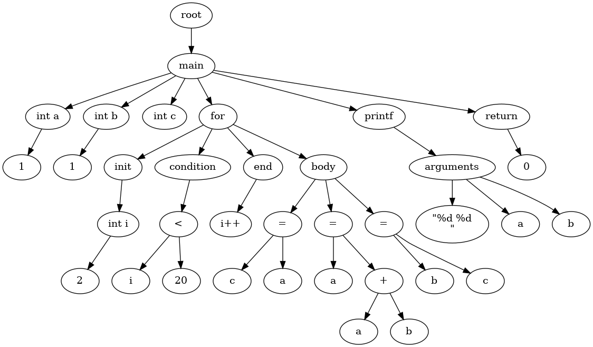

# 编译原理大作业

## TODO

- [x] 词法分析
- [x] 语法分析
  - [x] 逻辑运算, 算术运算, 比较运算
  - [x] while, for, if/elif/else, continue, break
  - [x] 多级指针
  - [x] 函数调用, 函数声明(不支持参数是数组)
  - [x] 数组
- [x] 类型检查/类型转换
  - [x] 数组初始化元素类型
  - [x] 普通变量初始化时类型
  - [x] 变量赋值时类型
  - [x] 函数返回值类型
- [x] 错误分析
  - [x] 数组访问时索引是否是整型
  - [x] 数组初始化时缺少大小
  - [x] 变量同作用域下重复声明问题
  - [x] 变量未定义问题
- [x] 代码优化
  - [x] 不会处理初始化但未使用的变量
  - [x] 去除 return 后面的语句
  - [x] 去除 break, continue 后面的语句
- [x] 中间代码生成(四元式)
- [x] 汇编程序

## 图形化

### 抽象语法树



### 依赖安装

```bash
sudo apt-get install graphviz-dev pkg-config pkgconf -y
```

## 构建

```
# ubuntu
sudo apt update
sudo apt install build-essential flex bison -y
```

系统版本( win11 的 linux 子系统 )

```
Distributor ID: Ubuntu
Description:    Ubuntu 22.04.1 LTS
Release:        22.04
Codename:       jammy
```

软件版本

```
gcc (Ubuntu 11.2.0-19ubuntu1) 11.2.0
flex 2.6.4
bison (GNU Bison) 3.8.2
```

```bash
make clean
```

```bash
make compile
```

## 文件结构

```
├── asm
│   ├── asm.py             # 中间代码转汇编程序
│   ├── const.py           # 一些常量, 寄存器说明
│   ├── dist               # 汇编及可执行文件
│   │   ├── ...
│   └── README.md
├── assets                 # 效果图
│   ├── ...
├── ast                    # 抽象语法树
│   ├── ast.c
│   ├── ast.h
│   ├── graph              # 绘制抽象语法树
│   │   ├── graph.c
│   │   └── graph.h
│   └── README.md
├── compile                # 最终生成中间代码的可执行文件
├── intermediate           # 中间代码生成
│   ├── intermediate.c
│   └── intermediate.h
├── lexer.l                # 词法分析
├── Makefile               # 构建脚本
├── output                 # 中间代码输出
│   ├── ...
├── parser.y               # 语法分析
├── README.md
├── semantics              # 类型检测等
│   ├── semantics.c
│   └── semantics.h
├── symtab                 # 符号表
│   ├── symtab.c
│   └── symtab.h
├── test                   # 测试用例
│   ├── dist               # 可执行文件
│   ├── ...
│   ├── Makefile
│   ├── pointer.c
│   └── README.md
└── utils
    ├── common.c
    ├── common.h            # 公共函数
    └── types.h             # 结点类型
```

## 汇编生成过程

### 测试用例

```c
int fib(int a, int b) {
    if (a > 1000) {
        return a * b % 5 - -1;
    }

    return fib(a + b, a) + 1;
}

int main() {
    printf("%d\n", fib(1, 1));
    return 0;
}
```

### 中间代码生成

```bash
./compile ./test/func.c
```

```
100: (FUNCTION, fib, _, _)
101: (PARAM, var0, _, _)
102: (PARAM, var1, _, _)
103: (=, int(1000), _, temp0)
104: (>, var0, temp0, 106)
105: (GOTO, _, _, 115)
106: (*, var0, var1, temp1)
107: (=, int(5), _, temp2)
108: (%, temp1, temp2, temp3)
109: (=, int(1), _, temp4)
110: (=, int(0), _, temp5)
111: (-, temp5, temp4, temp6)
112: (-, temp3, temp6, temp7)
113: (RETURN, _, _, temp7)
114: (GOTO, _, _, 124)
115: (#, #, #, #)
116: (+, var0, var1, temp8)
117: (ARG, temp8, _, _)
118: (ARG, var0, _, _)
119: (CALL, fib, _, temp9)
120: (=, int(1), _, temp10)
121: (+, temp9, temp10, temp11)
122: (RETURN, _, _, temp11)
123: (GOTO, _, _, 124)
124: (LEAVE, _, _, _)
125: (FUNCTION, main, _, _)
126: (#, #, #, #)
127: (=, string("%d\n"), _, temp12)
128: (ARG, temp12, _, _)
129: (#, #, #, #) ------------------> 这个不是四元式中的, 只不过方便转汇编而多加的
130: (=, int(1), _, temp13)
131: (ARG, temp13, _, _)
132: (=, int(1), _, temp14)
133: (ARG, temp14, _, _)
134: (CALL, fib, _, temp15)
135: (ARG, temp15, _, _)
136: (CALL, printf, _, _)
137: (=, int(0), _, temp16)
138: (RETURN, _, _, temp16)
139: (GOTO, _, _, 140)
140: (LEAVE, _, _, _)
```

### 汇编程序(AT&T)

与通过 [godbolt](https://gcc.godbolt.org/) 或者 `gcc -S xx.c` 查看的汇编有出入, 因为我这个汇编没做任何优化

总之能跑就不要管他了 （  ´д｀）ゞ

```python
19 # ...
20 fileName = "func"  # 修改 20 行的中间代码名
```

```bash
 python3 ./asm/asm.py
```

```
	.file "func.c"
	.text
	.globl fib
	.type fib, @function
fib:
LFB0:
	pushq %rbp
	movq %rsp, %rbp
	subq $16, %rsp
	movl %edi, -4(%rbp)
	movl %esi, -8(%rbp)
	cmpl $1000, -4(%rbp)
	jg .L0
	jmp .L1
.L0:
	movl -4(%rbp), %eax
	imull -8(%rbp), %eax
	cltd
	movl $5, %ecx
	idivl %ecx
	movl $0, %ebx
	subl $1, %ebx
	movl %edx, %eax
	subl %ebx, %eax
	jmp .L2
.L1:
	movl -4(%rbp), %edx
	movl -8(%rbp), %eax
	addl %eax, %edx
	movl -4(%rbp), %esi
	movl %edx, %edi
	CALL fib
	movl %eax, %edx
	movl $1, %eax
	addl %eax, %edx
	movl %edx, %eax
	jmp .L2
.L2:
	leave
	ret
.LC0:
	.string "%d\n"
	.text
	.globl main
	.type main, @function
main:
LFB1:
	pushq %rbp
	movq %rsp, %rbp
	movl $1, %esi
	movl $1, %edi
	CALL fib
	movl %eax, %esi
	leaq .LC0(%rip), %rax
	movq %rax, %rdi
	movl $0, %eax
	CALL printf@PLT
	movl $0, %eax
	jmp .L3
.L3:
	popq %rbp
	ret
```

## 实验设计

### 词法分析与语法分析

使用工具 flex/bison 实现

### 符号表

```c
AstNode* insert(char* name, int lineno) {
    unsigned int   key = hashCode(name);
    Entry*         np  = lookup(name); // 符号表中查找变量
    
    // ...

    if (np != NULL) {
        // 已经存在同名变量时
        if (declare == 0) {
            // 如果此时不是声明而是调用, 添加一个调用链
            AstRefNode* t = np->value->lines;
            while (t->lines != NULL) {
                t = t->lines;
            }
		   // 变量调用结点, 保存第几行调用
            t->lines = (AstRefNode*)newAstRefNode(np->value, lineno);

            return (AstNode*)t->lines; // 返回调用结点

        } else if (np->value->scope == curScope) {
            // 当前作用域声明同一个变量时, 会抛出重复声明的错误
            multiDeclareError(curScope, name);
        }
    }

    if (declare == 0) {
        // 符号表中不存在变量, 并且此时又不是声明时, 会抛出未声明错误
        isUndeclared(curScope, name);
    }

    // 符号表中不存在该符号或者此时在不同的作用域中, 则插入一个新的变量
    s = (AstSymbolNode*)newAstSymbolNode(name, lineno, curScope);

    np             = (Entry*)malloc(sizeof(Entry));
    np->key        = n;               // 保存符号名
    np->value      = s;               // 保存符号
    np->next       = hashTable[key];  // np->next 指向当前 hash 表的第一个词条
    hashTable[key] = np;              // 把 np 加入 hash 表第一个位置

    return (AstNode*)np->value;
}
```

### 中间代码生成

使用一个数组保存所有中间代码

```c
// 四元式结构体
typedef struct Four {
    char* loc;     // 地址
    char* op;      // 运算符
    char* arg1;    // 操作数一
    char* arg2;    // 操作数二
    char* result;  // 运算结果
} Four;
```

四元数数组

```c
typedef struct FourArray {
    int    capacity; // 容量
    int    top;      // 栈顶位置
    Four** list;     // 四元式指针数组
} FourArray;
```

之前其实使用的是深度优先遍历 `ast` 树, 但是遇到 `if` `while` 等语句时就犯难了, 因为它们需要进行 `回填` 操作, 而直接遍历无法进行回填, 所以才改变成数组的形式

```c
// if 语句
void createIfIntermediateCode(AstIfNode* node) {
    AstIfBranchNode* temp = (AstIfBranchNode*)node->branch;
    // ...
    FourArray* arr = newFourArray(); // if 分支栈

    while (temp) {
        if (temp->condition != NULL) {
            // else if 或 if 分支
            AstExpressionNode* t = (AstExpressionNode*)temp->condition;

            Four* s = createConditionIntermediateCode(t);

            // 不成立时跳转位置, 此时并不知道位置, 所以先初始化为 NULL
            go = gen(getLabel("%d", loc++), "GOTO", "_", "_", NULL);
            push(fa, go); // 压入栈中

            createBodyIntermediateCode(temp->body); // 生成 body 的中间代码

            if (temp) {
                // if 分支结束时跳转位置, 此时还未知
                Four* f = gen(getLabel("%d", loc++), "GOTO", "_", "_", NULL);
                push(fa, f);   // 压入四元式栈
                push(arr, f);  // 压入 if 分支栈
            }

            // 此时 body 已经生成结束, 已经可以知道跳转位置了
            go->result = getLabel("%d", loc);
            
            // ...
        } else {
            // else 分支
            createBodyIntermediateCode(temp->body);

            temp = (AstIfBranchNode*)temp->next;
        }
    }

    // 回填, 取出所有 if 分支, 此时所有 body 已经生成, 能够知道跳转位置了
    char* lo = getLabel("%d", loc);
    while ((f = pop(arr)) != NULL) {
        f->result = lo;
    }
}
```

同样 `while` 和 `return` 也使用了 `回填` 

### 错误处理/类型检查等

这里主要是在语法制导翻译的时候进行, 比如下面赋值语句的时候, 使用 `checkAssign` 检查赋值是否合理

```
assigment : var_ref ASSIGN expression
          { 
            checkAssign($1, $3); // 检查赋值是否合理
            $$ = newAstAssignNode($1, $3); // 变量赋值  
          };
```

在函数返回 `return` 语句时, 使用 `checkFunctionReturn` 进行返回值类型检查

```
return : RETURN expression SEMI
       {  
            $$ = newAstReturnNode(func->function->type, $2); 
            checkFunctionReturn(func, (AstReturnNode*)$$); /* 检测返回是否符合函数定义 */ 
       }
       | RETURN SEMI
       { 
            $$ = newAstReturnNode(func->function->type, NULL); 
            checkFunctionReturn(func, (AstReturnNode*)$$);
       }
       ;
```

### 汇编生成

汇编使用 `python` 对中间代码进行处理, 其实也可以在生成中间代码的时候进行汇编的生成, 但考虑到对 `c` 语言的不够熟悉, 所以采用了 `python` , 因为 `python` 有很多封装好的数据结构, api 等等非常方便, 也便于将整个代码进行解耦, 将不同的工作分开进行

```python
# 处理函数声明
def handleFunction(func: list[str]):
    # ...
    # 首先需要先遍历一遍, 统计整个函数中变量数和函数调用的情况
    for line in func:
        loc, op, arg1, _, result = re.findall(FOUR, line)[0]

        if (
            op == "GOTO"
            or op == "<"
            or op == ">"
            or op == ">="
            or op == "<="
            or op == "=="
            or op == "!="
        ):
            if label.get(result) is None:
                # 对于分支跳转语句, 需要给予 label
                label[result] = f".L{getLabel()}"

        elif op == "PARAM":
            params += 1
            vars[arg1] = ""  # 占位, 后面再生成

        elif op == "&":
            ref_temp.append(result)

        elif op == "=":
            if "var" in result and result not in vars:
                vars[result] = ""  # 占位

                if arg1 in ref_temp:
                    ref.append(result)
                else:
                    normal.append(result)

        elif op == "CALL":
            callNumber += 1

    # 先给指针赋偏移值, 差距要 8 个字节, 否则段错误
    for i, v in enumerate(ref):
        vars[v] = f"-{i * 8 + 4}(%rbp)"

    start = 0 if len(ref) == 0 else 4 + 8 * (len(ref) - 1)
    
    # 给普通变量分配栈地址
    for i, v in enumerate(normal):
        vars[v] = f"-{start + (i + 1) * 4}(%rbp)"
```

对于函数, 由于函数可以嵌套, 所以需要用一个栈来保存函数参数

```python
case "CALL":
    if arg1 == "printf":
        curArgs.extend(
            [
                "\tmovl $0, %eax\n",
                "\tCALL printf@PLT\n",
                "\tmovl $0, %eax\n",
            ]
        )
     elif result == "_":
        # 函数没有返回值
        curArgs.extend(
            [
                "\tmovl $0, %eax\n",
                "\tCALL {arg1}\n",
                "\tmovl $0, %eax\n",
            ]
        )
     else:
        curArgs.append(f"\tCALL {arg1}\n")

        vars[result] = "%eax"  # 函数返回值放在 eax 里

        if len(args) == 0:
            # 如果是第一层函数, 将函数调用代码插入 f
            f.append("".join(curArgs))
            curArgs = []
            curArg = None
        else:
            # 如果不是第一层调用, 恢复上一次的函数调用代码
            curArg = curArgs
            curArgs = args.pop()
            popR() # 恢复寄存器配置

case "ARG":
    # 将参数移入寄存器中
    a1 = vars[arg1]

    if a1.startswith("%r"):
        reg = getR().replace("e", "r")
        curArg.append(f"\tmovq {a1}, {reg}\n")
    else:
        curArg.append(f"\tmovl {a1}, {getR()}\n")

        curArgs.insert(0, "".join(curArg))

        curArg = []  # 继续收集其他参数

        reg = "%eax"
```

## 实验总结

本次实验有点难, 基本从零开始, 所以需要参考前人的代码进行编程, 然后本实验汇编部分有点问题, 因为之前学的王爽老师的 `32` 位汇编, 但这次使用了 `64` 位的, 并且 `AT&T` 格式的汇编还是第一次听说, 看了几天, 做是做出了了, 但是涉及到了变量中寄存器的分配问题还是有点棘手的, 因为有的表达式是需要先计算出两边的结果, 然后在进行计算的, 这样如果只使用一个寄存器 `%eax` 的话就会覆盖之前的计算结果, 当然这里可以使用多个寄存器, 比如 `%edx` 等等, 但这涉及到了寄存器分配的问题, 如何判断寄存器赋值但还未使用? 我使用了一个比较蠢的方法就是在分配寄存器时往后遍历几行中间代码, 然后如果后面不会立即使用, 则会切换寄存器, 也能成功, 但我还是觉得不够优雅, 不过就先这样吧🤗