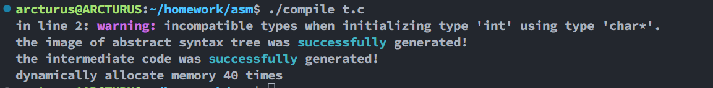
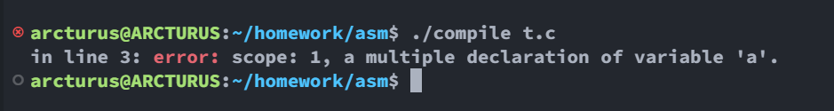
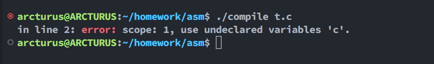
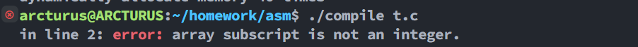
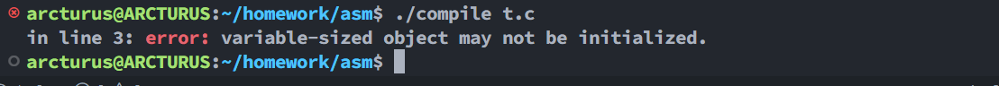
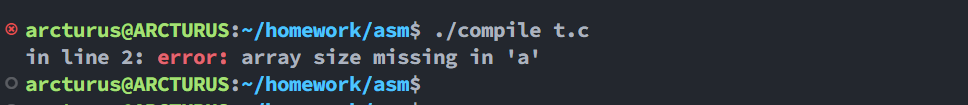
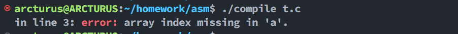
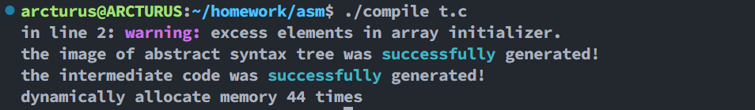

# 类型检查

## 类型不符警告

```c
#include <stdio.h>

void abc() {
    return 10;
}
```

会提示类型不兼容的警告


## 初始化类型不符警告

```c
int main() {
    int a = "123";
    return 0;
}
```



## 简单的类型转换

```c
int main() {
    int a = 2.3;
    a     = 1;
    return 0;
}
```

生成的中间代码会变成 `2`

```
100: (FUNCTION, main, _, _)
101: (=, int(2), _, temp0)
102: (=, temp0, _, var0)
103: (=, int(1), _, temp1)
104: (=, temp1, _, var0)
105: (=, int(0), _, temp2)
106: (RETURN, _, _, temp2)
107: (GOTO, _, _, 108)
108: (LEAVE, _, _, _)
```

# 错误处理

## 重复声明

```c
int main() {
    int a = 10;
    int a = 11;
    return 0;
}
```



## 未声明变量

```c
int main() {
    c = 10;
    return 0;
}
```



## 数组索引不是整型时

```c
int main() {
    int a[1.5];
    return 0;
}
```



## 数组索引是变量时

```c
int main() {
    int b = 1;
    int a[b];
    return 0;
}
```



## 数组大小缺失

```c
int main() {
    int a[];
    return 0;
}
```



## 数组索引缺失

```c
int main() {
    int a[1] = { 1 };
    a[]      = 10;
    return 0;
}
```



# 代码优化

去掉声明但未使用的变量

```c
int main() {
    int a = 2.3;
    return 0;
}
```

生成的中间代码不会出现变量 `a`

```
100: (FUNCTION, main, _, _)
101: (=, int(0), _, temp0)
102: (RETURN, _, _, temp0)
103: (GOTO, _, _, 104)
104: (LEAVE, _, _, _)
```

# 其他问题

## 数组初始化元素过多

```c
int main() {
    int a[2] = { 1, 2, 3 };
    return 0;
}
```

